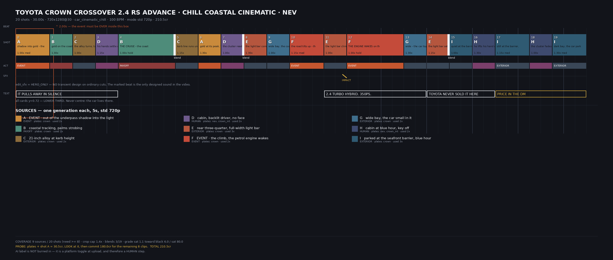

# PRODUCTION DOC — Toyota Crown Crossover 2.4 RS Advance · chill coastal cinematic · Nev
### Generated from `plans/crown.py` by `planqc.py`. Do not edit by hand — edit the plan.

**21 shots · 31.20s · 720x1280 @ 30fps · car_cinematic_chill · 100 BPM · mode `std` 720p**

---

## PLATES — generate and LOOK at these first

| plate | res | cr | status | must show |
|---|---|---|---|---|
| `crown` | 4k | 4 | NOT YET BUILT - build, LOOK at it, Gavril confirms the BODY is the CROSSOVER (not Sedan, not Signia) before any video credit | Toyota Crown CROSSOVER (S16) RS Advance: raised sedan-SUV body with a coupe-like falling roofline · full-width slim LED daytime bar with a hammerhead front · body-colour upper grille and a wide dark lower intake · black wheel-arch and rocker cladding · 21-inch dark multi-spoke alloys · full-width rear light bar · CROWN wordmark across the tailgate · two-tone black roof |
| `crown_int` | 4k | 4 | NOT YET BUILT - interior geometry is a named subject too | Crown Crossover cabin: twin 12.3-inch screens - instrument cluster and a separate landscape centre display · low wide fascia · rotary drive selector · two-tone black and tan hide |
| `nev` | 4k | 0 | existing 3-angle face set, no generation needed | his head shape, hair and shoulder line ONLY - the face is deliberately never lit in this build (his pick 2026-08-05) |

---

## TIMELINE

| # | in | dur | kind | source | crop | note |
|---|---|---|---|---|---|---|
| 0 | 0.00 | 1.80 | med | `A` EVENT · out of the underpass shadow into the light | 1.00x | shadow into gold - already moving, and silent |
| 1 | 1.80 | 1.20 | burst | `B` coastal tracking, palms strobing | 1.30x | gold on the coast road, still silent |
| 2 | 3.00 | 1.20 | burst | `C` 21-inch alloy at kerb height | 1.00x | the alloy turns, tarmac streaming, silent |
| 3 | 4.20 | 1.20 | burst | `D` cabin at golden hour, backlit driver, no face | 1.15x | his hands settle on the rim, silent, the road runs ahead |
| 4 | 5.40 | 1.80 | med | `B` coastal tracking, palms strobing | 1.00x | the coast road opens out, gold everywhere, nothing driving it |
| 5 | 7.20 | 1.20 | burst | `K` the Sabah shoreline past the barrier | 1.15x | the Sabah shoreline past the barrier, gold flat on the water |
| 6 | 8.40 | 1.20 | burst ◆ | `C` 21-inch alloy at kerb height | 1.30x | kerb line under the alloy at road level, the last of the gold |
| 7 | 9.60 | 1.20 | burst | `E` rear three-quarter, full-width light bar | 1.00x | the light bar comes on as the gold dies |
| 8 | 10.80 | 1.20 | burst | `G` wide bay, the car small in it | 1.30x | wide bay, the coast road bends away, the last gold flat on it |
| 9 | 12.00 | 1.20 | burst | `F_load` EVENT · the ramp, still electric | 1.15x | the road tilts up into the ramp - still electric, nothing running |
| 10 | 13.20 | 1.20 | burst | `J` cabin at dusk, the decision | 1.00x | HIS DECISION - the silhouette commits, foot down on the ramp |
| 11 | 14.40 | 3.00 | hold | `F_wake` EVENT · the engine catches | 1.00x | IT WAKES on the ramp because he asked for it |
| 12 | 17.40 | 1.20 | burst | `E` rear three-quarter, full-width light bar | 1.15x | the light bar pulls away from the ramp, climbing now |
| 13 | 18.60 | 1.20 | burst | `G` wide bay, the car small in it | 1.00x | wide - the car small, climbing toward the crest |
| 14 | 19.80 | 1.20 | burst | `F_wake` EVENT · the engine catches | 1.30x | at the crest it hardens and holds, steady under load |
| 15 | 21.00 | 1.20 | burst ◆ | `G` wide bay, the car small in it | 1.15x | the load falls away past the crest, it goes quiet again |
| 16 | 22.20 | 1.20 | burst | `I` parked at the seafront barrier, blue hour | 1.00x | quiet at the barrier, blue hour, nothing running |
| 17 | 23.40 | 1.20 | burst | `H` cabin at blue hour, key off | 1.30x | he sits, hand still on the rim at the barrier |
| 18 | 24.60 | 1.80 | med ◆ | `I` parked at the seafront barrier, blue hour | 1.15x | the bay from outside the barrier, the cabin still lit |
| 19 | 26.40 | 3.00 | hold | `H` cabin at blue hour, key off | 1.00x | HIS HAND KILLS IT - key off, the cabin goes dark |
| 20 | 29.40 | 1.80 | med | `I` parked at the seafront barrier, blue hour | 1.30x | dark bay, the car parked in it, nothing running |

◆ = blend after this shot (`dissolve`, 400ms)

---

## CARDS — y=0.72 lower third, never centre

| text | shots | kind |
|---|---|---|
| **CROWN. HYBRID. NO ENGINE YET** | 0–3 | cap |
| **SABAH COAST. STILL NOTHING RUNNING** | 5–8 | cap |
| **HE ASKS. IT WAKES.** | 11–13 | cap |
| **NEVER SOLD NEW IN MALAYSIA** | 15–17 | cap |
| **RECOND. DM FOR THE PRICE** | 18–20 | cta |

---

## PREVIZ — sketch-grade, never enters generation


_Nev appears in D, J and H - the sheet MUST carry the identity reference even though he is a silhouette. Not built; Gavril declined the ~2cr until unblocked._

**LIMIT:** a still sheet CANNOT depict shot 0 (a car crossing a light boundary while moving) or shot 11 (an engine waking). Both are judged at the PROBE.

Timeline board (real frames appear here automatically once clips exist):



---

## GENERATION PROMPTS — verbatim, as they will be sent

### `A` · EVENT · out of the underpass shadow into the light  ·  act: EVENT  ·  plates: crown

```
Vertical 9:16. THE EVENT SHOT - one action, over inside 1.5 seconds, motion already happening at frame zero, no settle. Static camera low at kerb height beside a coastal carriageway. The Toyota Crown Crossover from the reference image is ALREADY MOVING as the clip opens, emerging from the deep shade of a concrete underpass into full low-angle golden backlight, its full-width LED daytime bar lit, and sweeping past the lens. The transition from shade to blazing backlight happens ACROSS the car's body as it travels. The rest of the clip is the empty lit carriageway it left. Natural light only, no artificial fill, no colour gel. REAL FOOTAGE, NOT A RENDER: true specular roll-off along the body creases, clear-coat orange peel in the paint, faint panel-gap shadows, fine dust catching the low sun, accurate reflections in the windows, the far side of the car slightly softer than the near side, natural depth of field, neutral white balance, no HDR halos, no oversaturation. Unhurried camera - nothing whips, nothing shakes. Negative: CGI, videogame look, plastic-smooth surfaces, invented badges, exaggerated lens flare, crushed blacks, frantic camera movement, drift smoke. AUDIO: NO ENGINE, NO EXHAUST, NO COMBUSTION OF ANY KIND - the car is running on electric drive and is silent. No music, no voiceover, no dialogue. Only the hiss of tyres on warm tarmac, the rush of displaced air as the body passes the lens, and the change in room tone as it leaves the concrete underpass for open coastal air. Ambience: distant surf, faint.
```

### `B` · coastal tracking, palms strobing  ·  act: PAYOFF  ·  plates: crown

```
Vertical 9:16. THE SUSTAINED CRUISE - continuous motion, unbroken, no settle at the head. The Toyota Crown Crossover from the reference image driving at an easy pace along a palm-lined coastal carriageway at golden hour, tracked from a parallel vehicle, front three-quarter held steady. Palm shadows sweep rhythmically across the bodywork; the open bay and distant islands sit beyond the barrier. Camera moves smoothly with the car from first frame to last. Natural light only, no artificial fill, no colour gel. REAL FOOTAGE, NOT A RENDER: true specular roll-off along the body creases, clear-coat orange peel in the paint, faint panel-gap shadows, fine dust catching the low sun, accurate reflections in the windows, the far side of the car slightly softer than the near side, natural depth of field, neutral white balance, no HDR halos, no oversaturation. Unhurried camera - nothing whips, nothing shakes. Negative: CGI, videogame look, plastic-smooth surfaces, invented badges, exaggerated lens flare, crushed blacks, frantic camera movement, drift smoke. AUDIO: NO ENGINE, NO EXHAUST, NO COMBUSTION OF ANY KIND - the car is running on electric drive and is silent. No music, no voiceover, no dialogue. A steady, unchanging tyre hiss on open tarmac and a soft wind wash along the body for the whole clip. Ambience: open bay air and faint surf.
```

### `C` · 21-inch alloy at kerb height  ·  act: EXTERIOR  ·  plates: crown

```
Vertical 9:16. Tight tracking move at kerb height along the flank of the Toyota Crown Crossover from the reference image, holding on the 21-INCH DARK MULTI-SPOKE ALLOY turning and the black rocker cladding above it, tarmac texture streaming past underneath in the low sun. Natural light only, no artificial fill, no colour gel. REAL FOOTAGE, NOT A RENDER: true specular roll-off along the body creases, clear-coat orange peel in the paint, faint panel-gap shadows, fine dust catching the low sun, accurate reflections in the windows, the far side of the car slightly softer than the near side, natural depth of field, neutral white balance, no HDR halos, no oversaturation. Unhurried camera - nothing whips, nothing shakes. Negative: CGI, videogame look, plastic-smooth surfaces, invented badges, exaggerated lens flare, crushed blacks, frantic camera movement, drift smoke. AUDIO: NO ENGINE, NO EXHAUST, NO COMBUSTION OF ANY KIND - the car is running on electric drive and is silent. No music, no voiceover, no dialogue. Close tyre contact - tread pattern rolling on coarse tarmac, grit ticking in the tread, the surface note changing under the wheel.
```

### `D` · cabin at golden hour, backlit driver, no face  ·  act: HUMAN  ·  plates: nev, crown_int

```
Vertical 9:16. Interior of the Toyota Crown Crossover from the LAST reference image, shot from the passenger side. The man from the FIRST reference images is in the driver's seat but he is a PURE SILHOUETTE against a blazing golden side window - his face is NEVER lit and NEVER resolves, only the outline of his head, hair and shoulder reads. Both hands rest easily at the bottom of the steering rim. In front of him the 12.3-inch cluster shows a hybrid power meter, no rev counter. Backlit, high contrast, the sun doing all the work. Natural light only, no artificial fill, no colour gel. REAL FOOTAGE, NOT A RENDER: true specular roll-off along the body creases, clear-coat orange peel in the paint, faint panel-gap shadows, fine dust catching the low sun, accurate reflections in the windows, the far side of the car slightly softer than the near side, natural depth of field, neutral white balance, no HDR halos, no oversaturation. Unhurried camera - nothing whips, nothing shakes. Negative: CGI, videogame look, plastic-smooth surfaces, invented badges, exaggerated lens flare, crushed blacks, frantic camera movement, drift smoke. AUDIO: NO ENGINE, NO EXHAUST, NO COMBUSTION OF ANY KIND - the car is running on electric drive and is silent. No music, no voiceover, no dialogue. The cabin drop-out: outside noise distant and damped, the cabin still. Faint seat-cloth and leather movement as his hands settle on the rim, one quiet breath, a muted tyre rumble through the floor, a faint high electric whine rising with speed.
```

### `K` · the Sabah shoreline past the barrier  ·  act: EXTERIOR  ·  plates: crown

```
Vertical 9:16. Low slow tracking shot looking PAST the Toyota Crown Crossover from the reference image and out to sea - the car occupies the near edge of frame as a moving dark mass, and the subject is the SABAH shoreline beyond it: the Kota Kinabalu seafront promenade, coconut palms, the offshore island ridgelines low on the water, a small local fishing boat on the bay. Golden hour, the sun laying flat gold across the water. The camera travels with the car but is looking away from it. Natural light only, no artificial fill, no colour gel. REAL FOOTAGE, NOT A RENDER: true specular roll-off along the body creases, clear-coat orange peel in the paint, faint panel-gap shadows, fine dust catching the low sun, accurate reflections in the windows, the far side of the car slightly softer than the near side, natural depth of field, neutral white balance, no HDR halos, no oversaturation. Unhurried camera - nothing whips, nothing shakes. Negative: CGI, videogame look, plastic-smooth surfaces, invented badges, exaggerated lens flare, crushed blacks, frantic camera movement, drift smoke. AUDIO: NO ENGINE, NO EXHAUST, NO COMBUSTION OF ANY KIND - the car is running on electric drive and is silent. No music, no voiceover, no dialogue. Tyre hiss close and constant, wind, and distant surf and gulls beyond it.
```

### `E` · rear three-quarter, full-width light bar  ·  act: EXTERIOR  ·  plates: crown

```
Vertical 9:16. Rear three-quarter of the Toyota Crown Crossover from the reference image on the coastal carriageway at dusk, slow arc around the rear corner. The FULL-WIDTH REAR LIGHT BAR is lit and is the brightest thing in frame; the CROWN wordmark across the tailgate reads clearly; the sky behind has gone amber to violet. Natural light only, no artificial fill, no colour gel. REAL FOOTAGE, NOT A RENDER: true specular roll-off along the body creases, clear-coat orange peel in the paint, faint panel-gap shadows, fine dust catching the low sun, accurate reflections in the windows, the far side of the car slightly softer than the near side, natural depth of field, neutral white balance, no HDR halos, no oversaturation. Unhurried camera - nothing whips, nothing shakes. Negative: CGI, videogame look, plastic-smooth surfaces, invented badges, exaggerated lens flare, crushed blacks, frantic camera movement, drift smoke. AUDIO, TWO STATES, SPLIT AT THE MIDPOINT. FIRST HALF: NO ENGINE, NO EXHAUST, NO COMBUSTION OF ANY KIND - only tyre note and wind. SECOND HALF: a petrol engine is running and pulling away from the camera, its note receding with distance. No music, no voiceover, no dialogue.
```

### `G` · wide bay, the car small in it  ·  act: EXTERIOR  ·  plates: crown

```
Vertical 9:16. Wide static high-angle looking down over the Kota Kinabalu bay at dusk, the coastal carriageway curving through the lower third of frame AND RISING TO A CREST at the far side, the Toyota Crown Crossover from the reference image SMALL in the frame travelling along it. Offshore island ridgelines sit low in the haze; the last sun lies flat across the water. The car is a moving detail inside a landscape, not the subject. Natural light only, no artificial fill, no colour gel. REAL FOOTAGE, NOT A RENDER: true specular roll-off along the body creases, clear-coat orange peel in the paint, faint panel-gap shadows, fine dust catching the low sun, accurate reflections in the windows, the far side of the car slightly softer than the near side, natural depth of field, neutral white balance, no HDR halos, no oversaturation. Unhurried camera - nothing whips, nothing shakes. Negative: CGI, videogame look, plastic-smooth surfaces, invented badges, exaggerated lens flare, crushed blacks, frantic camera movement, drift smoke. AUDIO, TWO STATES, SPLIT AT THE MIDPOINT. FIRST HALF: NO ENGINE, NO EXHAUST, NO COMBUSTION OF ANY KIND - only wind over open water and distant surf. SECOND HALF: a petrol engine is faintly audible at long distance, thin and small inside the landscape, then easing off. No music, no voiceover, no dialogue.
```

### `F_load` · EVENT · the ramp, still electric  ·  act: EVENT  ·  plates: crown

```
Vertical 9:16. The Toyota Crown Crossover from the reference image approaching and starting a rising coastal ramp at dusk, tracked from a parallel vehicle, front three-quarter. The road visibly tilts upward through the shot and the car keeps its easy pace onto it - no acceleration yet, no drama, the body level. This clip is the SETUP for the shot that follows and must not contain the event itself. Natural light only, no artificial fill, no colour gel. REAL FOOTAGE, NOT A RENDER: true specular roll-off along the body creases, clear-coat orange peel in the paint, faint panel-gap shadows, fine dust catching the low sun, accurate reflections in the windows, the far side of the car slightly softer than the near side, natural depth of field, neutral white balance, no HDR halos, no oversaturation. Unhurried camera - nothing whips, nothing shakes. Negative: CGI, videogame look, plastic-smooth surfaces, invented badges, exaggerated lens flare, crushed blacks, frantic camera movement, drift smoke. AUDIO: NO ENGINE, NO EXHAUST, NO COMBUSTION OF ANY KIND - the car is running on electric drive and is silent. No music, no voiceover, no dialogue. Tyre note and wind only, with a faint electric whine holding steady. The quiet immediately before something happens.
```

### `J` · cabin at dusk, the decision  ·  act: HUMAN  ·  plates: nev, crown_int

```
Vertical 9:16. Interior of the Toyota Crown Crossover from the LAST reference image at dusk, shot from the passenger side, tight. The man from the FIRST reference images is a PURE SILHOUETTE against the violet windscreen - his face is NEVER lit and NEVER resolves. He is still for a beat, then his forearm and shoulder drop and set as he commits weight through his right foot, and the 12.3-inch cluster's power meter needle swings hard across into its power band. HIS MOVEMENT COMES FIRST, the meter answers it. Nothing else in frame moves. Natural light only, no artificial fill, no colour gel. REAL FOOTAGE, NOT A RENDER: true specular roll-off along the body creases, clear-coat orange peel in the paint, faint panel-gap shadows, fine dust catching the low sun, accurate reflections in the windows, the far side of the car slightly softer than the near side, natural depth of field, neutral white balance, no HDR halos, no oversaturation. Unhurried camera - nothing whips, nothing shakes. Negative: CGI, videogame look, plastic-smooth surfaces, invented badges, exaggerated lens flare, crushed blacks, frantic camera movement, drift smoke. AUDIO: the deepest near-silence in the film - faint cloth, a thin electric whine, nothing else. NO ENGINE, NO EXHAUST, NO COMBUSTION ANYWHERE IN THIS CLIP, not at the start, not at the end. The engine must NOT be heard starting here; it starts in the NEXT shot. No music, no voiceover, no dialogue.
```

### `F_wake` · EVENT · the engine catches  ·  act: EVENT  ·  plates: crown

```
Vertical 9:16. THE HERO. The Toyota Crown Crossover from the reference image climbing the rising coastal ramp at dusk, tracked from a parallel vehicle in front three-quarter. THE CLIP OPENS STILL SILENT AND STILL ON ELECTRIC DRIVE for a beat - then the petrol engine CATCHES and the car takes load: the nose lifts, the body settles back on its springs, the pace hardens decisively but without drama, and heat shimmer rises off the rear. THE TRANSITION FROM SILENT TO RUNNING HAPPENS ON CAMERA, inside this clip, and it happens EARLY - within the first second. Unhurried but unmistakably WORKING. Natural light only, no artificial fill, no colour gel. REAL FOOTAGE, NOT A RENDER: true specular roll-off along the body creases, clear-coat orange peel in the paint, faint panel-gap shadows, fine dust catching the low sun, accurate reflections in the windows, the far side of the car slightly softer than the near side, natural depth of field, neutral white balance, no HDR halos, no oversaturation. Unhurried camera - nothing whips, nothing shakes. Negative: CGI, videogame look, plastic-smooth surfaces, invented badges, exaggerated lens flare, crushed blacks, frantic camera movement, drift smoke. AUDIO - THIS IS THE ONLY COMBUSTION SOUND IN THE ENTIRE FILM: the clip opens in near silence with tyre roll and wind alone, then the petrol engine CATCHES - a brief crank, the four-cylinder fires, and the note rises and hardens under load as the ramp steepens, with turbo spool behind it. The catch must happen EARLY in the clip. Ambience: open coastal air. No music, no voiceover, no dialogue.
```

### `H` · cabin at blue hour, key off  ·  act: HUMAN  ·  plates: nev, crown_int

```
Vertical 9:16. Interior of the Toyota Crown Crossover from the LAST reference image at blue hour, parked and still, shot from the passenger side. The man from the FIRST reference images sits in the driver's seat as a PURE SILHOUETTE against the pale blue-grey sky through the windscreen - his face is NEVER lit and NEVER resolves. His hand leaves the steering rim, reaches, and PRESSES the start-stop button; the 12.3-inch cluster and the fascia lighting die out in the same movement. HIS ACTION CAUSES THE DARKNESS - the lights do not simply fade on their own. Natural light only, no artificial fill, no colour gel. REAL FOOTAGE, NOT A RENDER: true specular roll-off along the body creases, clear-coat orange peel in the paint, faint panel-gap shadows, fine dust catching the low sun, accurate reflections in the windows, the far side of the car slightly softer than the near side, natural depth of field, neutral white balance, no HDR halos, no oversaturation. Unhurried camera - nothing whips, nothing shakes. Negative: CGI, videogame look, plastic-smooth surfaces, invented badges, exaggerated lens flare, crushed blacks, frantic camera movement, drift smoke. AUDIO: a parked, still cabin. Seat-cloth and leather as he moves. The car's electronics power down - a single soft shutdown chime, then the last relay settles and the cabin goes completely quiet. Outside, faint water and wind, far away and damped. NO ENGINE, NO IDLE. No music, no voiceover, no dialogue.
```

### `I` · parked at the seafront barrier, blue hour  ·  act: EXTERIOR  ·  plates: crown

```
Vertical 9:16. The Toyota Crown Crossover from the reference image parked and stationary at a seafront barrier at blue hour, side-on and slightly behind, the flat promenade and the bay beyond it going dim. Very slow drift of the camera; THE WATER AND THE PALMS MOVE, the car does not. The full-width rear light bar and the cabin glow are the only lit things; the sky is deep blue with the last band of orange on the horizon. Natural light only, no artificial fill, no colour gel. REAL FOOTAGE, NOT A RENDER: true specular roll-off along the body creases, clear-coat orange peel in the paint, faint panel-gap shadows, fine dust catching the low sun, accurate reflections in the windows, the far side of the car slightly softer than the near side, natural depth of field, neutral white balance, no HDR halos, no oversaturation. Unhurried camera - nothing whips, nothing shakes. Negative: CGI, videogame look, plastic-smooth surfaces, invented badges, exaggerated lens flare, crushed blacks, frantic camera movement, drift smoke. AUDIO: a stopped car - nothing mechanical, nothing running. Only water against the seawall and a low steady wind. The quietest sound in the whole piece. NO ENGINE, NO IDLE. No music, no voiceover, no dialogue.
```

---

## THE EDIT — what the engine will do, with computed times

_times below are PLANNED; blends compress them - the engine re-times cards and declares ACTUAL cut boundaries after building._

**Cut grid** — every boundary on the 100 BPM beat (0.600s), frame-exact (`-frames:v`), each shot centred on a measured action peak, exposure matched on rendered segments BEFORE blending.

| after shot | t (planned) | treatment |
|---|---|---|
| 6 (kerb line under the alloy at road level, the last of the gold) | 9.60s | dissolve 400ms |
| 15 (the load falls away past the crest, it goes quiet again) | 22.20s | dissolve 400ms |
| 18 (the bay from outside the barrier, the cabin still lit) | 26.40s | dissolve 400ms |

All other cuts HARD (33-67ms). Blends 3/20 = 15% (profile 6-33%).

**Sound** — bed at 100 BPM (profile band 88-112), first transient trimmed to t=0 (phase, not just tempo). `edit_sfx = HERO_ONLY`: ONE impact, at the hero shot's own entry cut (shot 11). No whooshes anywhere. The bed SIDECHAIN-DUCKS under the sfx+foley key.

**Diegetic** — every shot lays its OWN clip audio (generated and paid for) on the actual timeline, plan-gained. Foreground (>=-6dB): shots [0, 1, 4, 9, 11, 12, 13, 14]. Bed HARD-ducks during shots [11]. Hero: THE PETROL ENGINE CATCHING (shot 11, 14.00s delivered), CAUSED by his commit in shot 10. ONE hero sound per video (file 04, law 4).

| t (planned) | cut entering | sound |
|---|---|---|
| 1.80s | shot 1 · gold on the coast road, still silent | — (hero_only) |
| 3.00s | shot 2 · the alloy turns, tarmac streaming, silent | — (hero_only) |
| 4.20s | shot 3 · his hands settle on the rim, silent, the road runs ahead | — (hero_only) |
| 5.40s | shot 4 · the coast road opens out, gold everywhere, nothing driving it | — (hero_only) |
| 7.20s | shot 5 · the Sabah shoreline past the barrier, gold flat on the water | — (hero_only) |
| 8.40s | shot 6 · kerb line under the alloy at road level, the last of the gold | — (hero_only) |
| 9.60s | shot 7 · the light bar comes on as the gold dies | — (hero_only) |
| 10.80s | shot 8 · wide bay, the coast road bends away, the last gold flat on it | — (hero_only) |
| 12.00s | shot 9 · the road tilts up into the ramp - still electric, nothing running | — (hero_only) |
| 13.20s | shot 10 · HIS DECISION - the silhouette commits, foot down on the ramp | — (hero_only) |
| 14.40s | shot 11 · IT WAKES on the ramp because he asked for it | **IMPACT (hero)** |
| 17.40s | shot 12 · the light bar pulls away from the ramp, climbing now | — (hero_only) |
| 18.60s | shot 13 · wide - the car small, climbing toward the crest | — (hero_only) |
| 19.80s | shot 14 · at the crest it hardens and holds, steady under load | — (hero_only) |
| 21.00s | shot 15 · the load falls away past the crest, it goes quiet again | — (hero_only) |
| 22.20s | shot 16 · quiet at the barrier, blue hour, nothing running | — (hero_only) |
| 23.40s | shot 17 · he sits, hand still on the rim at the barrier | — (hero_only) |
| 24.60s | shot 18 · the bay from outside the barrier, the cabin still lit | — (hero_only) |
| 26.40s | shot 19 · HIS HAND KILLS IT - key off, the cabin goes dark | — (hero_only) |
| 29.40s | shot 20 · dark bay, the car parked in it, nothing running | — (hero_only) |

**Captions** — cards.py PNGs on desktop (drawtext fallback flagged loudly), lower third y=0.72, re-timed to actual duration:

| card | shots | planned window |
|---|---|---|
| **CROWN. HYBRID. NO ENGINE YET** (cap) | 0-3 | 0.00-5.40s |
| **SABAH COAST. STILL NOTHING RUNNING** (cap) | 5-8 | 7.20-12.00s |
| **HE ASKS. IT WAKES.** (cap) | 11-13 | 14.40-19.80s |
| **NEVER SOLD NEW IN MALAYSIA** (cap) | 15-17 | 21.00-24.60s |
| **RECOND. DM FOR THE PRICE** (cta) | 18-20 | 24.60-31.20s |

**Grade** — saturation 1.1 ONLY (never double-grade; prompts already carry the night look), measured toward black_point 6.0 / saturation 80.0. Mix: engine auto-calibrates the sfx and foley layers against the bed (sfx -> bed-6dB, foley foreground -> bed-2dB, each clamped +/-8dB), then limiter 0.72 level=disabled -> highpass 30Hz -> limiter 0.70. verify.py gates -9.6..-6.5 LUFS and <=-1.0 dBTP. Output written atomically.

**Then the gates:** clipqc per clip -> engine build -> verify (15 checks, freshness FIRST — if it fails nothing else runs) -> JUDGES (kill-boring) -> Gavril.

---

## COST

- probe first: plates + shot `A` = **30.5 cr**, then LOOK
- remaining 11 clips = **247.5 cr**
- **total 278.0 cr**
