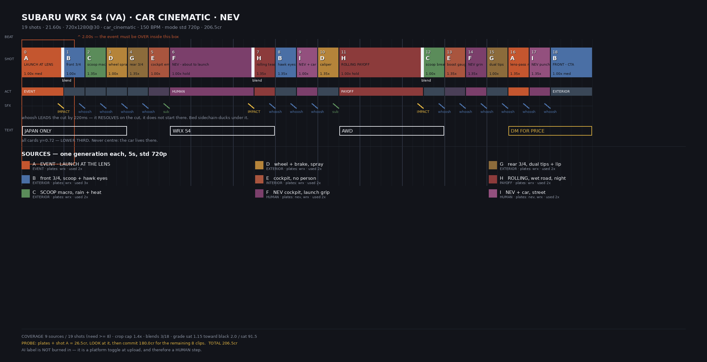

# PRODUCTION DOC — Subaru WRX S4 (VA) · car cinematic · Nev
### Generated from `plans/wrx.py` by `planqc.py`. Do not edit by hand — edit the plan.

**19 shots · 21.60s · 720x1280 @ 30fps · car_cinematic · 150 BPM · mode `std` 720p**

---

## PLATES — generate and LOOK at these first

| plate | res | cr | status | must show |
|---|---|---|---|---|
| `wrx` | 4k | 4 | TO GENERATE | VA-generation WRX S4 sedan: the large functional HOOD SCOOP · angular hawk-eye LED headlights · WRB world-rally-blue paint · wide lower grille with fog pockets · subtle boot lip (NOT the giant STI wing) · dual exhaust · 18in dark alloys |
| `nev` | 4k | 0 | 3-angle face set | actually him - face, hair, jawline, EARRING. Black tee. |

---

## TIMELINE

| # | in | dur | kind | source | crop | note |
|---|---|---|---|---|---|---|
| 0 | 0.00 | 1.60 | med ◆ | `A` EVENT · LAUNCH AT THE LENS | 1.00x | LAUNCH AT LENS |
| 1 | 1.60 | 0.80 | burst | `B` front 3/4, scoop + hawk eyes | 1.00x | front 3/4 |
| 2 | 2.40 | 0.80 | burst | `C` SCOOP macro, rain + heat | 1.35x | scoop macro |
| 3 | 3.20 | 0.80 | burst | `D` wheel + brake, spray | 1.00x | wheel spray |
| 4 | 4.00 | 0.80 | burst | `G` rear 3/4, dual tips + lip | 1.35x | rear 3/4 |
| 5 | 4.80 | 0.80 | burst | `E` cockpit, no person | 1.00x | cockpit empty |
| 6 | 5.60 | 3.20 | hold ◆ | `F` NEV cockpit, launch grip | 1.00x | NEV - about to launch |
| 7 | 8.80 | 0.80 | burst | `H` ROLLING, wet road, night | 1.35x | rolling tease |
| 8 | 9.60 | 0.80 | burst | `B` front 3/4, scoop + hawk eyes | 1.35x | hawk eyes |
| 9 | 10.40 | 0.80 | burst | `I` NEV + car, street | 1.00x | NEV + car |
| 10 | 11.20 | 0.80 | burst | `D` wheel + brake, spray | 1.35x | caliper |
| 11 | 12.00 | 3.20 | hold ◆ | `H` ROLLING, wet road, night | 1.00x | ROLLING PAYOFF |
| 12 | 15.20 | 0.80 | burst | `C` SCOOP macro, rain + heat | 1.00x | scoop breathes |
| 13 | 16.00 | 0.80 | burst | `E` cockpit, no person | 1.35x | boost gauge |
| 14 | 16.80 | 0.80 | burst | `F` NEV cockpit, launch grip | 1.35x | NEV grin |
| 15 | 17.60 | 0.80 | burst | `G` rear 3/4, dual tips + lip | 1.00x | dual tips |
| 16 | 18.40 | 0.80 | burst | `A` EVENT · LAUNCH AT THE LENS | 1.35x | lens-pass replay |
| 17 | 19.20 | 0.80 | burst | `I` NEV + car, street | 1.35x | NEV punch-in |
| 18 | 20.00 | 1.60 | med | `B` front 3/4, scoop + hawk eyes | 1.00x | FRONT - CTA |

◆ = blend after this shot (`mask_slice`, 400ms)

---

## CARDS — y=0.72 lower third, never centre

| text | shots | kind |
|---|---|---|
| **JAPAN ONLY** | 0–3 | cap |
| **WRX S4** | 6–7 | cap |
| **AWD** | 11–12 | cap |
| **DM FOR PRICE** | 16–18 | cta |

---

## PREVIZ — sketch-grade, never enters generation


_panel letters partly scrambled by the model; CONTENT mapping: launch=A front=B scoopmacro=C wheel=D cockpit=E nev-seat=F rear=G rolling=H nev-lean=I_

**LIMIT:** STILL PREVIZ CANNOT DEPICT THE v2 HOOK - a static frame cannot show 'charging at the lens'; the model rendered a parked front view. The hook is judged at the PROBE, never at previz. Do not reroll sketches.

Timeline board (real frames appear here automatically once clips exist):



---

## GENERATION PROMPTS — verbatim, as they will be sent

### `A` · EVENT · LAUNCH AT THE LENS  ·  act: EVENT  ·  plates: wrx

```
Vertical 9:16. THE EVENT SHOT - ONE action only, over inside 1.5 seconds, NO settle, motion already happening at frame zero. Static camera at knee height in the MIDDLE OF THE LANE on a wet night street. The Subaru WRX S4 from the reference image is already at full throttle COMING STRAIGHT AT THE CAMERA as the clip opens - hood scoop and angular headlights filling more of the frame every frame, all four wheels throwing spray. At about 1.2 seconds it SWERVES and rips past within inches, spray and wind shear whipping across the lens, headlight flare raking over it. The rest of the clip is the empty wet street it left, mist drifting through the streetlight. Night. One hard artificial key plus the car's own light; deep shaped shadows; wet asphalt doubling every light source. WR Blue paint reads deep and saturated in the highlights, near-black in shadow. Neutral white balance, no HDR halos. REAL FOOTAGE, NOT A RENDER: true specular roll-off along the creases, clear-coat orange peel, faint panel-gap shadows, fine rain mist catching the key light, accurate glass reflections, natural depth of field. Negative: CGI, videogame look, plastic-smooth surfaces, over-bright fill, invented badges, tall rear wing.
```

### `B` · front 3/4, scoop + hawk eyes  ·  act: EXTERIOR  ·  plates: wrx

```
Vertical 9:16. The Subaru WRX S4 from the reference image, front three-quarter, parked, night, wet ground. Slow arc across the nose. The LARGE HOOD SCOOP is the subject - its dark opening clearly readable - with the angular LED headlights the brightest thing in frame. Night. One hard artificial key plus the car's own light; deep shaped shadows; wet asphalt doubling every light source. WR Blue paint reads deep and saturated in the highlights, near-black in shadow. Neutral white balance, no HDR halos. REAL FOOTAGE, NOT A RENDER: true specular roll-off along the creases, clear-coat orange peel, faint panel-gap shadows, fine rain mist catching the key light, accurate glass reflections, natural depth of field. Negative: CGI, videogame look, plastic-smooth surfaces, over-bright fill, invented badges, tall rear wing.
```

### `C` · SCOOP macro, rain + heat  ·  act: EXTERIOR  ·  plates: wrx

```
Vertical 9:16. Extreme macro on the HOOD SCOOP of the Subaru WRX S4 from the reference image at night. Rain beads stream across the blue bonnet toward the scoop's dark opening; one engine rev makes heat-haze shimmer rise from it and pulls a wisp of mist inward. Fills the frame - no background. Night. One hard artificial key plus the car's own light; deep shaped shadows; wet asphalt doubling every light source. WR Blue paint reads deep and saturated in the highlights, near-black in shadow. Neutral white balance, no HDR halos. REAL FOOTAGE, NOT A RENDER: true specular roll-off along the creases, clear-coat orange peel, faint panel-gap shadows, fine rain mist catching the key light, accurate glass reflections, natural depth of field. Negative: CGI, videogame look, plastic-smooth surfaces, over-bright fill, invented badges, tall rear wing.
```

### `D` · wheel + brake, spray  ·  act: EXTERIOR  ·  plates: wrx

```
Vertical 9:16. Tight tracking move at wheel height along the flank of the Subaru WRX S4 from the reference image, holding on the dark 18-inch multi-spoke alloy and the brake caliper behind it, fine road spray flicking off the tread. Car creeping slowly, camera moving with it. Night. One hard artificial key plus the car's own light; deep shaped shadows; wet asphalt doubling every light source. WR Blue paint reads deep and saturated in the highlights, near-black in shadow. Neutral white balance, no HDR halos. REAL FOOTAGE, NOT A RENDER: true specular roll-off along the creases, clear-coat orange peel, faint panel-gap shadows, fine rain mist catching the key light, accurate glass reflections, natural depth of field. Negative: CGI, videogame look, plastic-smooth surfaces, over-bright fill, invented badges, tall rear wing.
```

### `E` · cockpit, no person  ·  act: INTERIOR  ·  plates: wrx

```
Vertical 9:16. Interior of the Subaru WRX S4 from the reference image, no people. Slow drift across the driver-focused cockpit: red-stitched black seats and wheel, aluminium pedals, boost gauge glow on the dash, red ambient needles. Parked, night, instrument glow against darkness. Night. One hard artificial key plus the car's own light; deep shaped shadows; wet asphalt doubling every light source. WR Blue paint reads deep and saturated in the highlights, near-black in shadow. Neutral white balance, no HDR halos. REAL FOOTAGE, NOT A RENDER: true specular roll-off along the creases, clear-coat orange peel, faint panel-gap shadows, fine rain mist catching the key light, accurate glass reflections, natural depth of field. Negative: CGI, videogame look, plastic-smooth surfaces, over-bright fill, invented badges, tall rear wing.
```

### `F` · NEV cockpit, launch grip  ·  act: HUMAN  ·  plates: nev, wrx

```
Vertical 9:16. The man from the FIRST reference images seated in the driver's seat of the Subaru WRX S4 from the LAST reference image, shot from the passenger side, CLOSE - head and shoulders fill the upper half of frame. Black tee. Both hands set on the wheel, he rolls his shoulders once, exhales, then his eyes flick up to the road - the face of someone about to launch. Instrument glow and one streetlight on his face. His face, hair and EARRING must match the references exactly - real skin texture, pores, natural asymmetry, no smoothing. Night. One hard artificial key plus the car's own light; deep shaped shadows; wet asphalt doubling every light source. WR Blue paint reads deep and saturated in the highlights, near-black in shadow. Neutral white balance, no HDR halos. REAL FOOTAGE, NOT A RENDER: true specular roll-off along the creases, clear-coat orange peel, faint panel-gap shadows, fine rain mist catching the key light, accurate glass reflections, natural depth of field. Negative: CGI, videogame look, plastic-smooth surfaces, over-bright fill, invented badges, tall rear wing.
```

### `G` · rear 3/4, dual tips + lip  ·  act: EXTERIOR  ·  plates: wrx

```
Vertical 9:16. Rear three-quarter of the Subaru WRX S4 from the reference image, night, wet asphalt. The subtle boot LIP SPOILER (no tall wing), DUAL round exhaust tips breathing faint vapour, tail lights lit and doubled in the wet ground. Slow arc around the rear corner. Night. One hard artificial key plus the car's own light; deep shaped shadows; wet asphalt doubling every light source. WR Blue paint reads deep and saturated in the highlights, near-black in shadow. Neutral white balance, no HDR halos. REAL FOOTAGE, NOT A RENDER: true specular roll-off along the creases, clear-coat orange peel, faint panel-gap shadows, fine rain mist catching the key light, accurate glass reflections, natural depth of field. Negative: CGI, videogame look, plastic-smooth surfaces, over-bright fill, invented badges, tall rear wing.
```

### `H` · ROLLING, wet road, night  ·  act: PAYOFF  ·  plates: wrx

```
Vertical 9:16. THE PAYOFF - sustained motion, unbroken, no settle at the head. The Subaru WRX S4 from the reference image driving hard on a wet city road at night, tracked from a parallel vehicle, front three-quarter held. Streetlights smear into horizontal streaks; the car stays sharp; spray trails off all four arches - unmistakably all-wheel drive. Continuous camera movement first frame to last. Night. One hard artificial key plus the car's own light; deep shaped shadows; wet asphalt doubling every light source. WR Blue paint reads deep and saturated in the highlights, near-black in shadow. Neutral white balance, no HDR halos. REAL FOOTAGE, NOT A RENDER: true specular roll-off along the creases, clear-coat orange peel, faint panel-gap shadows, fine rain mist catching the key light, accurate glass reflections, natural depth of field. Negative: CGI, videogame look, plastic-smooth surfaces, over-bright fill, invented badges, tall rear wing.
```

### `I` · NEV + car, street  ·  act: HUMAN  ·  plates: nev, wrx

```
Vertical 9:16. The man from the FIRST reference images leaning back against the front fender of the Subaru WRX S4 from the LAST reference image on a wet street at night, arms crossed, relaxed, looking at the lens. Black tee. Framed close enough that his face is large and clearly readable. Headlight glow rims him from behind. Face, hair and EARRING match the references exactly - real skin, no smoothing. Night. One hard artificial key plus the car's own light; deep shaped shadows; wet asphalt doubling every light source. WR Blue paint reads deep and saturated in the highlights, near-black in shadow. Neutral white balance, no HDR halos. REAL FOOTAGE, NOT A RENDER: true specular roll-off along the creases, clear-coat orange peel, faint panel-gap shadows, fine rain mist catching the key light, accurate glass reflections, natural depth of field. Negative: CGI, videogame look, plastic-smooth surfaces, over-bright fill, invented badges, tall rear wing.
```

---

## THE EDIT — what the engine will do, with computed times

_times below are PLANNED; blends compress them - the engine re-times cards and declares ACTUAL cut boundaries after building._

**Cut grid** — every boundary on the 150 BPM beat (0.400s), frame-exact (`-frames:v`), each shot centred on a measured action peak, exposure matched on rendered segments BEFORE blending.

| after shot | t (planned) | treatment |
|---|---|---|
| 0 (LAUNCH AT LENS) | 1.60s | mask_slice 400ms |
| 6 (NEV - about to launch) | 8.80s | mask_slice 400ms |
| 11 (ROLLING PAYOFF) | 15.20s | mask_slice 400ms |

All other cuts HARD (33-67ms). Blends 3/18 = 16% (profile 6-33%).

**Sound** — synthesized drift-phonk bed at 150 BPM, first transient trimmed to t=0 (phase, not just tempo). SFX layer at +13.5dB with the bed SIDECHAIN-DUCKING under it; every whoosh LEADS its cut by 220ms and resolves ON it.

| t (planned) | cut entering | sound |
|---|---|---|
| 1.60s | shot 1 · front 3/4 | IMPACT (section) |
| 2.40s | shot 2 · scoop macro | whoosh |
| 3.20s | shot 3 · wheel spray | whoosh |
| 4.00s | shot 4 · rear 3/4 | whoosh |
| 4.80s | shot 5 · cockpit empty | whoosh |
| 5.60s | shot 6 · NEV - about to launch | SUB-DROP (into hold) |
| 8.80s | shot 7 · rolling tease | IMPACT (section) |
| 9.60s | shot 8 · hawk eyes | whoosh |
| 10.40s | shot 9 · NEV + car | whoosh |
| 11.20s | shot 10 · caliper | whoosh |
| 12.00s | shot 11 · ROLLING PAYOFF | SUB-DROP (into hold) |
| 15.20s | shot 12 · scoop breathes | IMPACT (section) |
| 16.00s | shot 13 · boost gauge | whoosh |
| 16.80s | shot 14 · NEV grin | whoosh |
| 17.60s | shot 15 · dual tips | whoosh |
| 18.40s | shot 16 · lens-pass replay | whoosh |
| 19.20s | shot 17 · NEV punch-in | whoosh |
| 20.00s | shot 18 · FRONT - CTA | whoosh |

**Captions** — cards.py PNGs on desktop (drawtext fallback flagged loudly), lower third y=0.72, re-timed to actual duration:

| card | shots | planned window |
|---|---|---|
| **JAPAN ONLY** (cap) | 0-3 | 0.00-4.00s |
| **WRX S4** (cap) | 6-7 | 5.60-9.60s |
| **AWD** (cap) | 11-12 | 12.00-16.00s |
| **DM FOR PRICE** (cta) | 16-18 | 18.40-21.60s |

**Grade** — saturation 1.15 ONLY (never double-grade; prompts already carry the night look), measured toward black_point 2.0 / saturation 91.5. Mix: bed +12dB, limiter 0.76 level=disabled, target -7..-9 LUFS. Output written atomically.

**Then the gates:** clipqc per clip -> engine build -> verify (10 checks, freshness first) -> JUDGES (kill-boring) -> Gavril.

---

## COST

- probe first: plates + shot `A` = **26.5 cr**, then LOOK
- remaining 8 clips = **180.0 cr**
- **total 206.5 cr**
